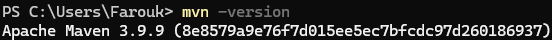
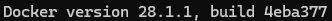
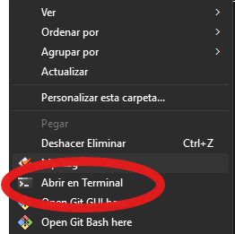
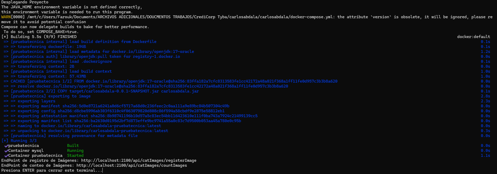
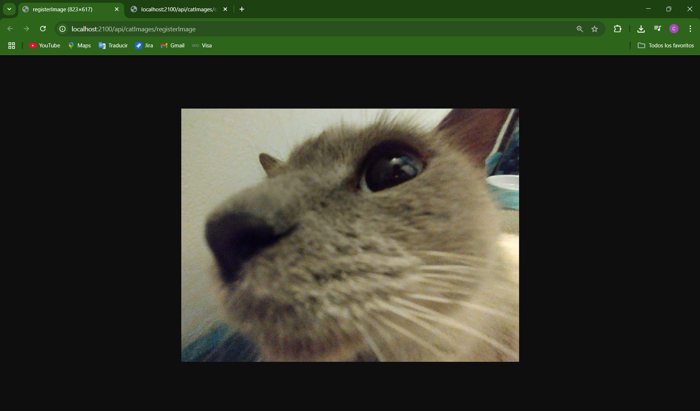
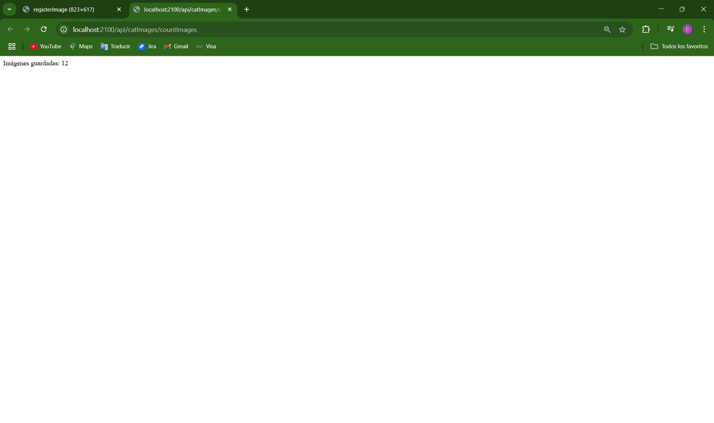

# Prueba Técnica Tyba - Credicorp

Carlos Farouk Abdalá Rincón

## Instrucciones de uso

Tras descargar el repositorio del proyecto, inicialmente es necesario verificar la instalación de Maven para poder ejecutar comandos de gestión del proyecto. Para verificar, ingrese e el terminal el siguiente comando:

```cpp
mvn -version
```
Debería ver el versionamiento de la siguiente manera



En caso de que no vea la versión por favor dirigirse a este link e instalar Maven:
https://maven.apache.org/download.cgi

De igual manera verifique la instalación de Docker:
```cpp
docker -version
```


En caso de no tenerlo instalado, puede seguir el siguiente link: https://docs.docker.com/desktop/

Para continuar, dirijase a la carpeta en al que descargo el repositorio. Una vez se encuentre en la carpeta, oprima click derecho sobre esta y busque la opción "Abrir en Terminal":



una vez en el terminal, ejecute cualquiera de los siguientes comandos:
```cpp
./run.sh
bash run.sh
```
Es posible que se le solicite abrir alguna aplicación, en ese caso seleccione la que prefiera que tenga funciones para ejecución de comandos.
Debería ver lo siguiente o de manera muy similar:



Si se fija al final de los mensajes, ya puede acceder a los endpoints.

## Endpoints

El sistema back end desarrollado tiene dos enpoints que son los siguientes: 

- http://localhost:2100/api/catImages/registerImage: Endpoint que recupera imágenes de los gatos, las almacena en formato binario en la base de datos e incluye fecha de último llamado a cada imagen registrada y de creación de cada registro.
  

- http://localhost:2100/api/catImages/countImages: En este endpoint se recuperarán la cantidad de registros que tiene la base de datos.


Es necesario aclarar que por facilidad de acceso, ambos endpoints estan diseñados para recibir peticiones de tipo "GET" para poder ser accedidos desde el anvegador web de preferencia sin necesidad de un desarrollo de front.

## Imagen de Docker Hub

Aunque se hizo la implementación pertinente de Continuous Deployement (CD) para el despliegue automático de la imagen cada vez que se haga un push a la rama main del repositorio,
en el siguiente link se pueder encontrar la imagen "pruebatecnica" que corresponde al sistema desarrollado:
https://hub.docker.com/r/farouk21/pruebatecnica